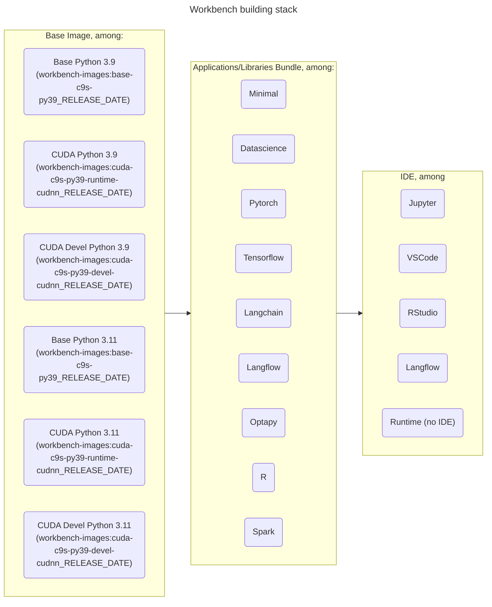
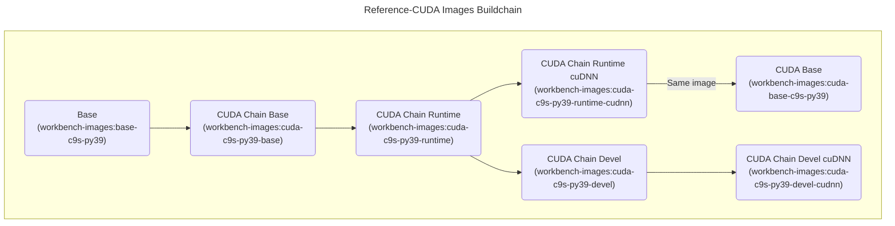

# Development

Here are some information on how to develop new recipes for Bundles, IDEs,.., as well on information on how the images are structured.

## Repository Organization

This repository is applying the Github Flow strategy (new features or bug fixes branching from `main`) with a Git Flow twist: as we want to support different releases simultaneously and update them regularly (security patches or bug fixes), each new release (20XXy) will have its own support branch created and maintained, principally with regular updates of the `requirements.txt` files to rebuild the images.

So the flow is:

- Develop or fix on branches from the `main` branch.
- Once a new release is ready to get out, create a branch with this release name.
- Fixes or improvements that concern multiple branches (like this README) can be applied to `main` then cherry picked and applied to other relevant branches.
- Images are built from their respective branch using the naming scheme described below.

## Image Naming Convention

Images have all the same name to fit in a single repo: `workbench-images`. The TAG is used to differentiate them with this scheme: `{cuda}-{ide}-{bundle}-{os}-{python}_{release}_{date}`:

- `cuda` is a flag with two possible values: **cuda** if this is a CUDA-enabled image, or empty if it is not.
- `ide` is the IDE that will be launched when the image starts. E.g. Jupyter, VSCode, RStudio, Langflow,... The value is **runtime** if this is a runtime only image without an IDE.
- `bundle` is the name of the set of libraries or applications included in this image. E.g. Datascience, Pytorch, Tensorflow, Langchain,...
- `os` is the name of the OS on which the image is based. In this repo it's always CentOS Stream 9 (c9s). This placeholder allows for others to be used eventually.
- `python` is the version of Python used in the image (Python is always included). Currently, available versions are 3.9 and 3.11.
- `release` is the release number, which follows a YearIndex pattern, e.g. 2023b for the first release of 2023, then 2023c,...
- `date` is the date of the build of a given release. Images are **built and updated regularly** to apply patches and bug fixes, following semantic versioning. This means that for a given release number, major and minor versions of packages won't change (only z in version x.y.z).

## Build chain

The build chain is fully modularized with 3 different steps (Base->Bundle->IDE). This  allow for:

- Reuse and easier maintenance of recipes and code.
- Better management of dependencies, preventing one package in one recipe to block updates in others.
- Reduced image size, avoiding too multiple layers and wasted space.

Of course this also allows for an easy extension of the recipes (see [DEVELOPMENT](development.md)), and an easy creation of combinations not released.

## Building Workbench or Runtime Images

### Base images

The `base` and `cuda-layer` folders contain a `Makefile`, as well as a `README` file with examples on how to use the Makefile.
You must create the base images first (Python 3.9 and 3.11), then create the CUDA images that will derive from them (see schema above for the CUDA build chain).

If you only want to add some packages to those base images, simply modify the file `base/c9s/os-packages.txt` and create the images.

For further modifications, you can also modify the `Containerfile` in the same folder.

### Snippets

Snippets are simple and reusable "recipes". In all the snippets, placeholders for variables, like ${VARIABLE}, are modified automatically by the wizard when it is building the full recipe.

There are 3 different types of snippets: Base, Bundle, and IDE.

### Base

This is the basic start of the Containerfile we want want to build, with the FROM instructions and some LABELS.

### Bundles

The bundles subfolders can have any name, as they are automatically discovered by the wizard. The provided bundles folder names start with a number and an hyphen to force the order in which they will appear. This number and hyphen will be removed in the build process to get the "official" name of the bundle.

There must be a `display.txt` file at the root of the bundle, with the content you want to be displayed by the wizard when it will ask to choose a bundle.

Each bundle can have one or more optional sections (subfolders), depending on the different types of actions you have to make to install a specific bundle.

Some sections will use generic segments of Containerfile code that are at the root of the `bundles` folder:

- `os_packages.snippet` to deploy packages listed in an os-packages.txt file
- `python_packages.snippet` to deploy a set a Python packages from a requirements.txt file.

The different sections are:

- The `builder` folder contains the code (part of a Containerfile) to create a "builder" container image for a multi-stage build. The name must be `builder.snippet`.
- The `custom` folder contains custom code (part of a Containerfile) that can be inserted after the OS packages installation. The name must be `custom.snippet`.
- The `os` folder contains the file `os-packages.txt` that is a simple list of all the OS packages that must be installed.
- The `py##` folders contain `requirements.txt` and eventually `requirements-jupyter.txt` files that list all the Python packages to be installed. See the next section to learn more about how those files are created.

#### Python requirements creation

Two files only are really needed in the build process to add Python packages: `requirements.txt` and `requirements-jupyter.txt` (only if you want to use Jupyter as an IDE). You can of course create those manually, but achieving a stable and fully compatible configuration that includes all the dependencies is often a challenge.

Therefore, the following process is used to create those files:

- Use [pipenv](https://pipenv.pypa.io/en/latest/) to manage dependencies and check compatibility.
- Create Pipfile listing all the required packages at the needed versions.
- In a specific release (e.g. 2023c), versions should be fixed at Major and Minor revisions. Only Patch number is allowed to change to properly apply bug and security fixes in an update to the release, while keeping compatibility 99%+ of the time.
- The Pipfile should have the standard **packages** section, but also another one called **jupyter**. This allows to lock both categories simultaneously, making them fully compatible (including their respective dependencies), while allowing to install only the packages needed for the bundle without installing Jupyter. You can then install the IDE of your choice. If this one is Jupyter, it will be fully compatible with the bundle, and will not add/remove/update any shared dependency during the install process. This saves space in the image, while ensuring compatibility and stability.
- Lock the dependencies with `pipenv lock`.
- Export the requirements file with `pipenv requirements > requirements.txt` (this will export the **packages** section only with its dependencies) and `pipenv requirements --categories="jupyter" > requirements-jupyter.txt` (this will export the **jupyter** section only with its dependencies).

NOTE: Why get back to requirements file and not use micropipenv or pipenv directly to install the packages?

- Because pipenv should not be used in a Containerized environment (as per its authors), especially in our case where we are already working in a virtual Python environment (/opt/app-root).
- And because micropipenv (which was so far used in image building) does not support the different categories option.

### IDEs

The ides subfolders can have any name, as they are automatically discovered by the wizard. The provided ides folder names start with a number and an hyphen to force the order in which they will appear. This number and hyphen will be removed in the build process to get the "official" name of the ide.

There must be a `display.txt` file at the root of the ide, with the content you want to be displayed by the wizard when it will ask to choose an ide.

Each IDE recipe must have:

- A Containerfile snippet with the code to install the IDE. The name must be the same as the folder name without the number and the hyphen, with the extension "snippet". (e.g. `jupyter.snippet`)
- A folder named `files` with the supplementary files you want to be copied to the recipe and available for the Containerfile `COPY` commands.

