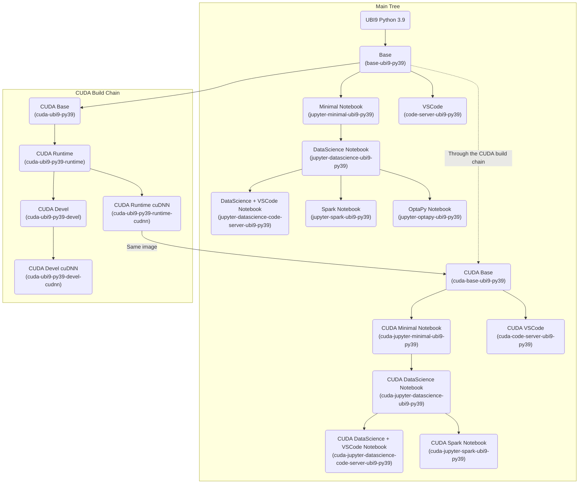
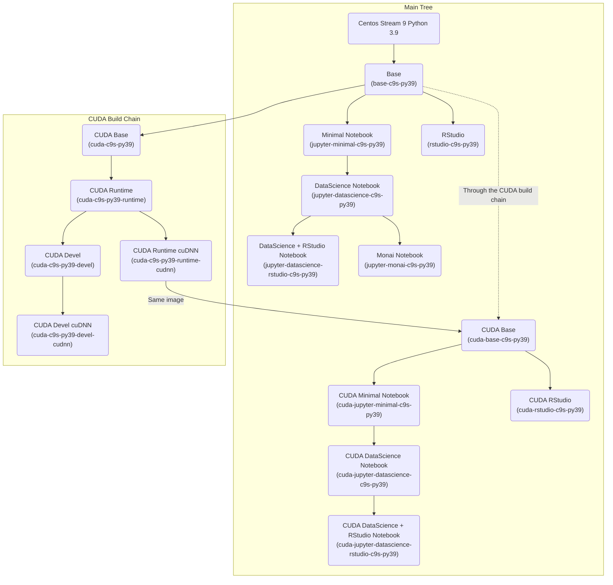
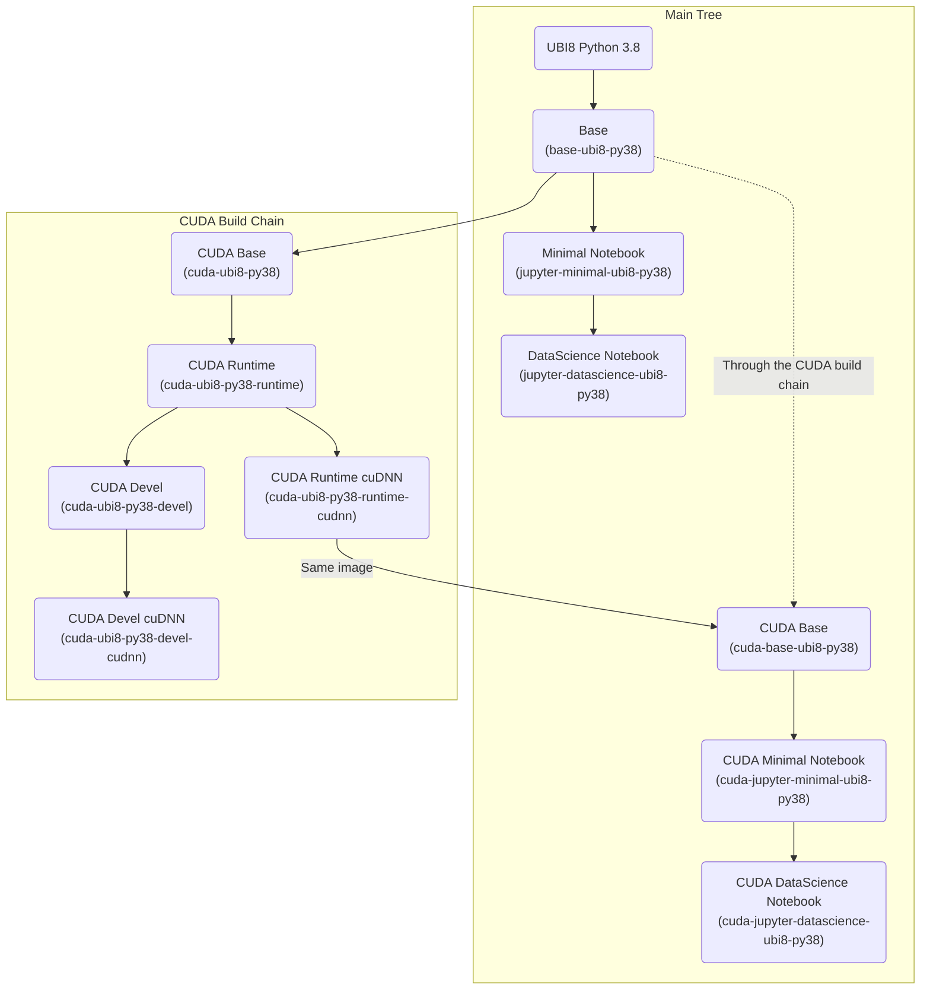

# Workbench Images

*[See changelog](CHANGELOG.md)*

Various images (Jupyter, RStudio, VSCode,...) to use with [Open Data Hub](http://opendatahub.io/) (ODH) or [Red Hat OpenShift Data Science](https://www.redhat.com/fr/technologies/cloud-computing/openshift/openshift-data-science) (RHODS).

## Base images

Different flavors are available, based on UBI8, UBI9 or Centos Stream 9, with different versions of Python:

- [Base image based on UBI9 with Python 3.9](https://quay.io/opendatahub-contrib/workbench-images:base-ubi9-py39_2023a_latest)
- [Base image based on CentOS Stream 9 with Python 3.9](https://quay.io/opendatahub-contrib/workbench-images:base-c9s-py39_2023a_latest)
- [Base image based on UBI8 with Python 3.8](https://quay.io/opendatahub-contrib/workbench-images:base-ubi8-py38_2023a_latest)

*[source](base)*

## CUDA base images

CUDA-enabled versions of the Base images:

- CUDA version: 11.8.0
- CuDNN version: 8.6.0

NOTE: the images listed here are the Runtime+CuDNN versions. The intermediate images from the CUDA build chain are not listed here, but available in the repo, as well as development images that may be needed to create further images when building packages from source. See the tree graphs below for image names.

- [CUDA Base image based on UBI9 with Python 3.9](https://quay.io/opendatahub-contrib/workbench-images:cuda-base-ubi9-py39_2023a_latest)
- [CUDA Base image based on CentOS Stream 9 with Python 3.9](https://quay.io/opendatahub-contrib/workbench-images:cuda-base-c9s-py39_2023a_latest)
- [CUDA Base image based on UBI8 with Python 3.8](https://quay.io/opendatahub-contrib/workbench-images:cuda-base-ubi8-py38_2023a_latest)

*[source](cuda-layer)*

## Jupyter Images

All these images use JupyterLab as the main environment, which is started by default and listens on port 8888.

### Minimal Notebook images

Minimal JupyterLab Notebook image with additional basic packages. The list and version of included packages is available in the [README](jupyter/minimal/README.md) file in the corresponding [folder](jupyter/minimal/).

Images derive from the Base image, with different flavors:

- [Minimal JupyterLab Notebook image on UBI9 with Python 3.9](https://quay.io/opendatahub-contrib/workbench-images:jupyter-minimal-ubi9-py39_2023a_latest)
- [Minimal JupyterLab Notebook image on CentOS Stream 9 with Python 3.9](https://quay.io/opendatahub-contrib/workbench-images:jupyter-minimal-c9s-py39_2023a_latest)
- [Minimal JupyterLab Notebook image on UBI8 with Python 3.8](https://quay.io/opendatahub-contrib/workbench-images:jupyter-minimal-ubi8-py38_2023a_latest)

*[source](jupyter/minimal)*

### Datascience Notebook images

JupyterLab Notebook images with standard datascience packages, in different flavors (see above). The list and version of included packages is available in the [README](jupyter/datascience/README.md) file in the corresponding [folder](jupyter/datascience/).

- [Datascience JupyterLab Notebook image on UBI9 with Python 3.9](https://quay.io/opendatahub-contrib/workbench-images:jupyter-datascience-ubi9-py39_2023a_latest)
- [Datascience JupyterLab Notebook image on Centos Stream 9 with Python 3.9](https://quay.io/opendatahub-contrib/workbench-images:jupyter-datascience-c9s-py39_2023a_latest)
- [Datascience JupyterLab Notebook image on UBI8 with Python 3.8](https://quay.io/opendatahub-contrib/workbench-images:jupyter-datascience-ubi8-py38_2023a_latest)

*[source](jupyter/datascience)*

### Datascience + VSCode (Code-Server) Notebook image

Notebook based on the UBI9 Data Science notebook, adding VSCode ([Code-Server](https://github.com/coder/code-server)).

- [Datascience + VSCode JupyterLab Notebook image on UBI9 with Python 3.9](https://quay.io/opendatahub-contrib/workbench-images:jupyter-datascience-code-server-ubi9-py39_2023a_latest)

*[source](jupyter/datascience-code-server)*

### Datascience + RStudio Notebook image

Notebook based on the Centos Stream9 Data Science notebook, adding an R Kernel for Jupyter and RStudio.

- [Datascience + RStudio JupyterLab Notebook image on Centos Stream 9 with Python 3.9](https://quay.io/opendatahub-contrib/workbench-images:jupyter-datascience-rstudio-c9s-py39_2023a_latest)

*[source](jupyter/datascience-rstudio)*

### Spark image

Notebook based on the UBI9 Data Science notebook, adding Spark/PySpark capabilities.

- [Spark/PySpark 3.3.1 with Hadoop 3.3.4 based on jupyter-datascience-ubi9-py39](https://quay.io/opendatahub-contrib/workbench-images:jupyter-spark-ubi9-py39_2023a_latest)

*[source](jupyter/spark)*

### Optapy image

Notebook based on the UBI9 Data Science notebook, adding [OptaPy](https://www.optapy.org/optapy/latest/optapy-introduction/optapy-introduction.html) 8.31.1b0, the Python version of OptaPlanner.

- [OptaPy based on jupyter-datascience-ubi9-py39](https://quay.io/opendatahub-contrib/workbench-images:jupyter-optapy-ubi9-py39_2023a_latest)

*[source](jupyter/optapy)*

## CUDA-enabled Jupyter Images

### CUDA Minimal Notebook images

CUDA-enabled Minimal JupyterLab Notebook image with additional basic packages. The list and version of included packages is available in the [README](jupyter/minimal/README.md) file in the corresponding [folder](jupyter/minimal/).

Images derive from the Base image, with different flavors:

- [CUDA Minimal JupyterLab Notebook image on UBI9 with Python 3.9](https://quay.io/opendatahub-contrib/workbench-images:cuda-jupyter-minimal-ubi9-py39_2023a_latest)
- [CUDA Minimal JupyterLab Notebook image on CentOS Stream 9 with Python 3.9](https://quay.io/opendatahub-contrib/workbench-images:cuda-jupyter-minimal-c9s-py39_2023a_latest)
- [CUDA Minimal JupyterLab Notebook image on UBI8 with Python 3.8](https://quay.io/opendatahub-contrib/workbench-images:cuda-jupyter-minimal-ubi8-py38_2023a_latest)

*[source](jupyter/minimal)*

### CUDA Datascience Notebook images

CUDA-enabled JupyterLab Notebook images with standard datascience packages, in different flavors (see above). The list and version of included packages is available in the [README](jupyter/datascience/README.md) file in the corresponding [folder](jupyter/datascience/).

- [CUDA Datascience JupyterLab Notebook image on UBI9 with Python 3.9](https://quay.io/opendatahub-contrib/workbench-images:cuda-jupyter-datascience-ubi9-py39_2023a_latest)
- [CUDA Datascience JupyterLab Notebook image on Centos Stream 9 with Python 3.9](https://quay.io/opendatahub-contrib/workbench-images:cuda-jupyter-datascience-c9s-py39_2023a_latest)
- [CUDA Datascience JupyterLab Notebook image on UBI8 with Python 3.8](https://quay.io/opendatahub-contrib/workbench-images:cuda-jupyter-datascience-ubi8-py38_2023a_latest)

*[source](jupyter/datascience)*

### CUDA Datascience + VSCode (Code-Server) Notebook image

CUDA-enabled notebook based on the UBI9 Data Science notebook, adding VSCode ([Code-Server](https://github.com/coder/code-server)).

- [Datascience + VSCode JupyterLab Notebook image on UBI9 with Python 3.9](https://quay.io/opendatahub-contrib/workbench-images:cuda-jupyter-datascience-code-server-ubi9-py39_2023a_latest)

*[source](jupyter/datascience-code-server)*

### CUDA Datascience + RStudio Notebook image

CUDA-enabled notebook based on the Centos Stream9 Data Science notebook, adding an R Kernel for Jupyter and RStudio.

- [Datascience + RStudio JupyterLab Notebook image on Centos Stream 9 with Python 3.9](https://quay.io/opendatahub-contrib/workbench-images:jupyter-datascience-rstudio-c9s-py39_2023a_latest)

*[source](jupyter/datascience-rstudio)*

### CUDA Monai Notebook image

CUDA-enabled JupyterLab DataScience Notebook image with the addition of [Monai](https://monai.io/) 1.1.0 and [OpenCV](https://opencv.org/).

- [Monai JupyterLab Notebook image on Centos Stream 9 with Python 3.9](https://quay.io/opendatahub-contrib/workbench-images:jupyter-monai-c9s-py39_2023a_latest)

*[source](jupyter/monai)*

## VSCode (Code-Server)

NOTE: The following images are Standalone VSCode (Code-Server) images. **The ODH or RHODS dashboards are not compatible** with these images yet. However, a standalone deployment file using the Kubeflow Notebook Controller is available: `code-server-example.yaml`

- [VSCode image on UBI9 with Python 3.9](https://quay.io/opendatahub-contrib/workbench-images:code-server-ubi9-py39_2023a_latest)
- [CUDA VSCode image on UBI9 with Python 3.9](https://quay.io/opendatahub-contrib/workbench-images:cuda-code-server-ubi9-py39_2023a_latest)

*[source](code-server)*

## RStudio

NOTE: The following images are Standalone RStudio images. **The ODH or RHODS dashboards are not compatible** with these images yet. However, a standalone deployment file using the Kubeflow Notebook Controller is available: `rstudio-example.yaml`

- [RStudio image on Centos Stream 9 with Python 3.9](https://quay.io/opendatahub-contrib/workbench-images:rstudio-c9s-py39_2023a_latest)
- [CUDA RStudio image on Centos Stream 9 with Python 3.9](https://quay.io/opendatahub-contrib/workbench-images:cuda-rstudio-c9s-py39_2023a_latest)

*[source](rstudio)*

## Development

### Building images

All image folders contain a `Makefile`, as well as a `README` file with examples on how to use the Makefile.

The Makefile contains targets to build and to validate the image(s). The validation will check for the different binaries required depending on the image type, run a notebook in the image to validate the Python stack, and launch and try to access the different servers (JupyterLab, VSCode, RStudio,...). So even if the image does not do exactly what you want (open an issue!), it should always start properly.

### Naming convention

Images have all the same name to fit in a single repo: `workbench-images`. The TAG is used to differentiate them with this scheme: `{flavor}_{release}_{date}`:

- `flavor` is the type of the image, including its main purpose (e.g. "jupyterlab-datascience"), the base container image (e.g. "ubi9") and the Python version (e.g. "py39" for Python 3.9).
- `release` is the release number, which follows a YearIndex pattern, e.g. 2023a for the first release of 2023, then 2023b,...
- `date` is the date of the build of a given release. Images are **built and updated on a weekly basis** to apply patches and bug fixes, following semantic versioning. This means that for a given release number, major and minor versions of packages won't change (only z in version x.y.z).

### Repository organization

This repository is applying the Github Flow strategy (new features or bug fixes branching from `main`) with a Git Flow twist: as we want to support different releases simultaneously and update them regularly (security patches or bug fixes), each new release (20XXy) will have its own support branch created and maintained, principally with weekly updates of the `Pipfile.lock` files to rebuild the images.

So the flow is:

- Develop or fix on branches from the `main` branch.
- Once a new release is ready to get out, create a branch with this release name.
- Fixes or improvements that concern multiple branches (like this README) can be applied to `main` then cherry picked and applied to other relevant branches.
- Images are built from their respective branch using the naming scheme described above.

### Build chain

Notes:

- All the images support S2I for Python to be easily extended.
- UBI8 + Python 3.8 tree is mostly there for reference. There should not be further images based on it. Official ODH/RHODS images based on UBI8 and Python 3.8 are [available here](https://github.com/opendatahub-io/notebooks).
- New development and images in this repo will be on UBI9 + Python 3.9 base, or CentOS Stream 9 where UBI9 is not possible due to lack of OS packages (for RStudio for example).

### UBI9 Python 3.9 Tree

### CentOS Stream 9 Python 3.9 Tree

### UBI8 Python 3.8 Tree

