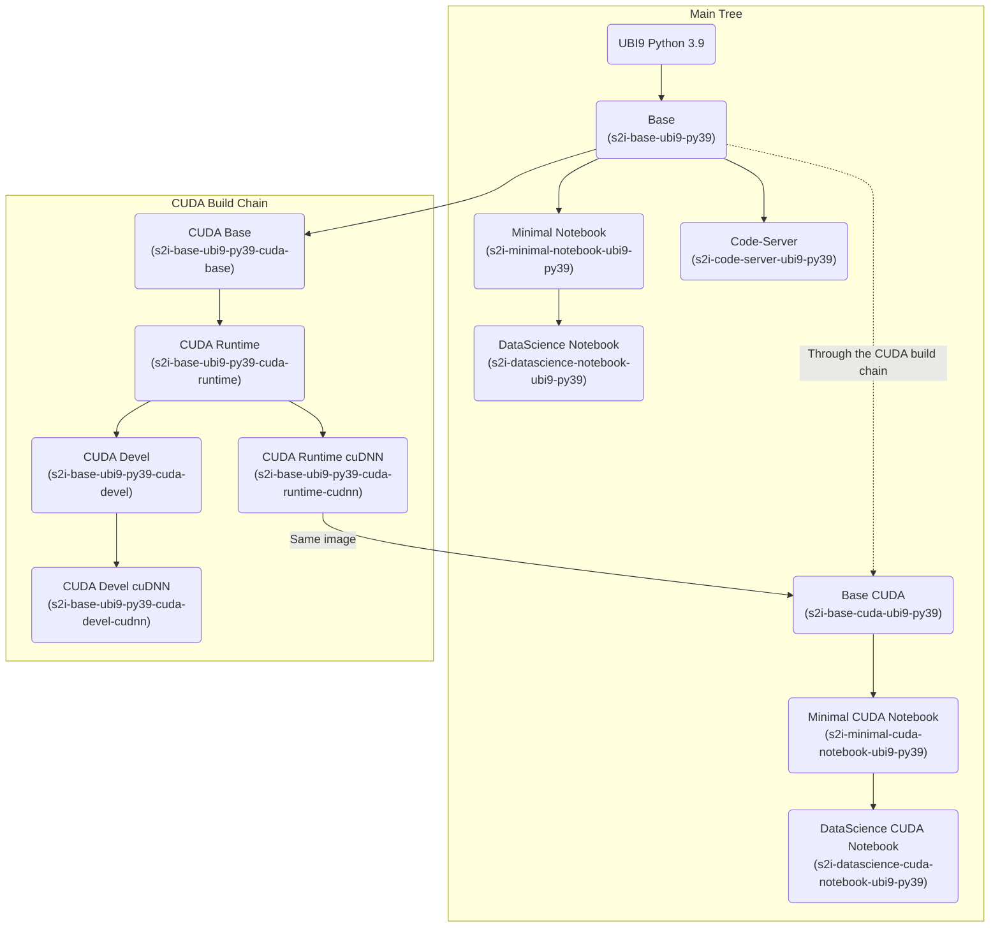
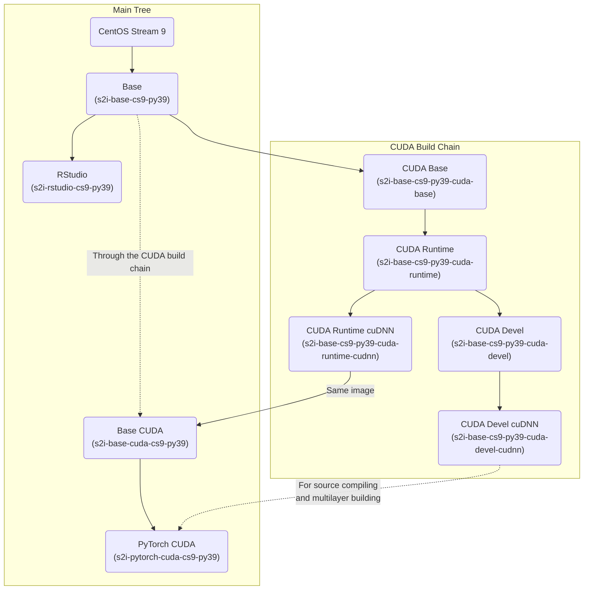

# JupyterHub Custom Notebook Images

Those images were created to be used with ODH or RHODS with the **Kubeflow Notebook Controller as the launcher (from ODH1.4 and RHODS ...)**

## Non-CUDA images

(see next section for the images tree graphs)

### S2I base images from UBI or CentOS Stream + Python

- Base s2i image based on UBI9 with Python 3.9: [s2i-base-ubi9-py39](https://quay.io/repository/guimou/s2i-base-ubi9-py39)
- Base s2i image based on CentOS Stream 9 with Python 3.9: [s2i-base-cs9-py39](https://quay.io/repository/guimou/s2i-base-cs9-py39)
- Base s2i image based on UBI8 with Python 3.8: [s2i-base-ubi8-py38](https://quay.io/repository/guimou/s2i-base-ubi8-py38)

### S2I Minimal Notebook images

Minimal JupyterLab Notebook image, no additional Python packages, in different flavors (see above)

- Minimal JupyterLab Notebook image on UBI9 with Python 3.9: [s2i-minimal-notebook-ubi9-py39](https://quay.io/repository/guimou/s2i-minimal-notebook-ubi9-py39)
- Minimal JupyterLab Notebook image on UBI8 with Python 3.8: [s2i-minimal-notebook-ubi8-py38](https://quay.io/repository/guimou/s2i-minimal-notebook-ubi8-py38)

### S2I Datascience Notebook images

JupyterLab Notebook images with standard datascience packages, in different flavors (see above)

- Datascience Notebook image on UBI9 with Python 3.9: [s2i-datascience-notebook-ubi9-py39](https://quay.io/repository/guimou/s2i-datascience-notebook-ubi9-py39)
- Datascience Notebook image on UBI8 with Python 3.8: [s2i-datascience-notebook-ubi8-py38](https://quay.io/repository/guimou/s2i-datascience-notebook-ubi8-py38)

### RStudio image

- RStudio with R 4.1: [s2i-rstudio-cs9-py39](https://quay.io/repository/guimou/s2i-rstudio-cs9-py39)

### Code-Server image

- Code-Server v4.5.1: [s2i-code-server-cs9-py39](https://quay.io/repository/guimou/s2i-code-server-cs9-py39)

## CUDA images

NOTE: the intermediate images from the CUDA build chain are not listed here, but available in the repos. Devel images may be needed to create further custom notebooks when building packages from source. See the tree graphs below for image names.

### S2I base CUDA images from UBI or CentOS Stream + Python

- Base CUDA s2i image based on UBI9 with Python 3.9: [s2i-base-cuda-ubi9-py39](https://quay.io/repository/guimou/s2i-base-ubi9-py39)
- Base CUDA s2i image based on CentOS Stream 9 with Python 3.9: [s2i-base-cuda-cs9-py39](https://quay.io/repository/guimou/s2i-base-cs9-py39)
- Base CUDA s2i image based on UBI8 with Python 3.8: [s2i-base-cuda-ubi8-py38](https://quay.io/repository/guimou/s2i-base-ubi8-py38)

### S2I CUDA Minimal Notebook images

Minimal JupyterLab Notebook image with CUDA, no additional Python packages, in different flavors (see above)

- Minimal JupyterLab Notebook image on UBI9 with Python 3.9: [s2i-minimal-cuda-notebook-ubi9-py39](https://quay.io/repository/guimou/s2i-minimal-cuda-notebook-ubi9-py39)
- Minimal JupyterLab Notebook image on UBI8 with Python 3.8: [s2i-minimal-cuda-notebook-ubi8-py38](https://quay.io/repository/guimou/s2i-minimal-cuda-notebook-ubi8-py38)

### S2I CUDA Datascience Notebook images

JupyterLab Notebook images with standard datascience packages, in different flavors (see above)

- Datascience Notebook image on UBI9 with Python 3.9: [s2i-datascience-cuda-notebook-ubi9-py39](https://quay.io/repository/guimou/s2i-datascience-cuda-notebook-ubi9-py39)
- Datascience Notebook image on UBI8 with Python 3.8: [s2i-datascience-cuda-notebook-ubi8-py38](https://quay.io/repository/guimou/s2i-datascience-cuda-notebook-ubi8-py38)

## Images build logic

Notes:

- All the images support S2I to be easily extended.
- UBI8 + Python 3.8/Python 3.9 are there for reference only and backward compatibility.
- New development and images will be on UBI9 + Python 3.9 base, or CentOS Stream 9 if UBI9 is not possible.
- For example, RStudio is built on a CentOS Stream 9 (and not UBI9) as many packages are missing to install R properly in the UBI lines (even with all base repos and epel enabled).

### UBI9 Python 3.9 Tree

### CentOS Stream 9 Python 3.9 Tree

### UBI8 Python 3.8 Tree

