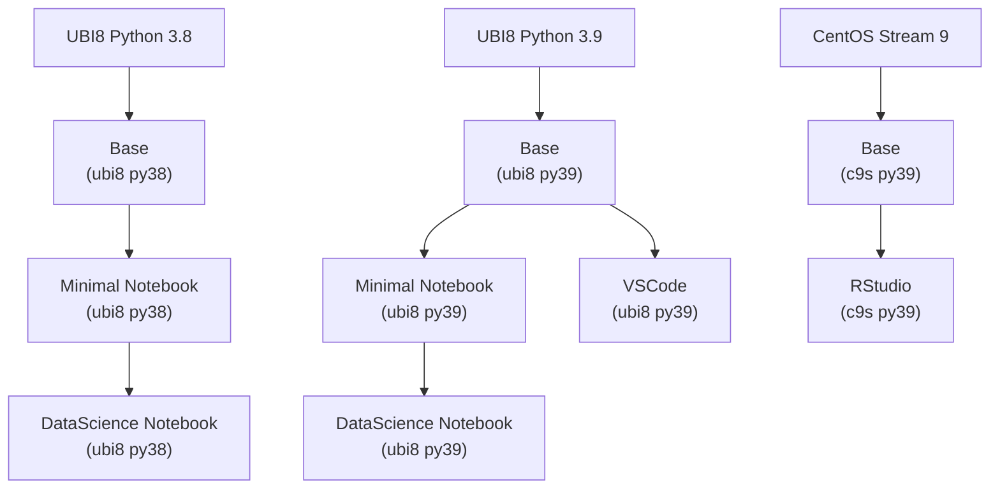

# JupyterHub Custom Notebook Images

Those images were created to be used with ODH or RHODS with Kubeflow Notebook Controller as the launcher (from ODH1.4 and RHODS ...)

## Images build logic

Notes:

- All the images support S2I to be easily extended.
- RStudio is built on a CentOS Stream 9 as packages are missing to install R properly in the UBI lines (even with all base repos and epel enabled).

