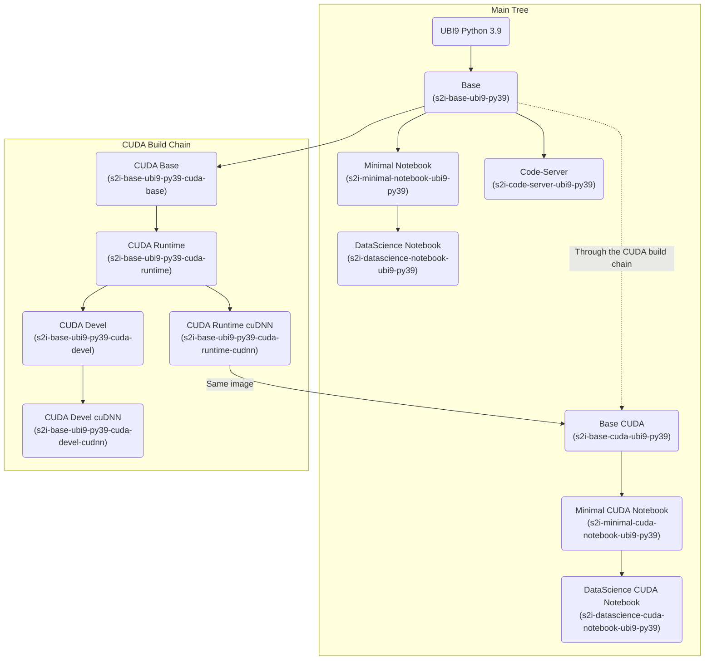
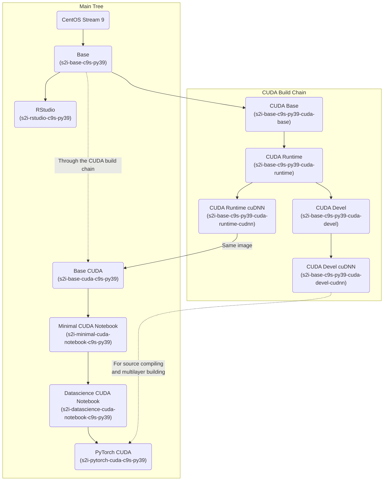

# JupyterHub Custom Notebook Images

These images were created to be used with Open Data Hub (ODH) or Red Hat Openshift Data Science (RHODS) with the **Kubeflow Notebook Controller as the launcher (from ODH1.4 and RHODS ...)**

See this [section](###-images-build-logic) for the full image trees.

## Standard images (not CUDA-enabled)

### S2I base images from UBI or CentOS Stream + Python

- Base s2i image based on UBI9 with Python 3.9: [s2i-base-ubi9-py39](https://quay.io/repository/guimou/s2i-base-ubi9-py39)
- Base s2i image based on CentOS Stream 9 with Python 3.9: [s2i-base-c9s-py39](https://quay.io/repository/guimou/s2i-base-c9s-py39)
- Base s2i image based on UBI8 with Python 3.8: [s2i-base-ubi8-py38](https://quay.io/repository/guimou/s2i-base-ubi8-py38)

### S2I Minimal Notebook images

Minimal JupyterLab Notebook image, no additional Python packages, in different flavors (see above)

- Minimal JupyterLab Notebook image on UBI9 with Python 3.9: [s2i-minimal-notebook-ubi9-py39](https://quay.io/repository/guimou/s2i-minimal-notebook-ubi9-py39)
- Minimal JupyterLab Notebook image on CentOS Stream 9 with Python 3.9: [s2i-minimal-notebook-c9s-py39](https://quay.io/repository/guimou/s2i-minimal-notebook-c9s-py39)
- Minimal JupyterLab Notebook image on UBI8 with Python 3.8: [s2i-minimal-notebook-ubi8-py38](https://quay.io/repository/guimou/s2i-minimal-notebook-ubi8-py38)

### S2I Datascience Notebook images

JupyterLab Notebook images with standard datascience packages, in different flavors (see above). The list of included packages is available in the README file in the corresponding [folder](s2i-datascience-notebook/).

- Datascience Notebook image on UBI9 with Python 3.9: [s2i-datascience-notebook-ubi9-py39](https://quay.io/repository/guimou/s2i-datascience-notebook-ubi9-py39)
- Datascience Notebook image on CentOS Stream 9 with Python 3.9: [s2i-datascience-notebook-c9s-py39](https://quay.io/repository/guimou/s2i-datascience-notebook-c9s-py39)
- Datascience Notebook image on UBI8 with Python 3.8: [s2i-datascience-notebook-ubi8-py38](https://quay.io/repository/guimou/s2i-datascience-notebook-ubi8-py38)

### Spark image

Notebook based on the Data Science notebook, adding Spark capabilities.

- Spark/PySpark 3.3.1 with Hadoop 3.3.4 based on s2i-datascience-notebook-ubi9-py39: [s2i-spark-notebook-ubi9-py39](https://quay.io/repository/guimou/s2i-spark-notebook-ubi9-py39)

### RStudio image

- RStudio with R 4.1: [s2i-rstudio-c9s-py39](https://quay.io/repository/guimou/s2i-rstudio-c9s-py39)

NOTE: This image works with the Kubeflow Notebook Controller, but the ODH or RHODS dashboard launcher cannot yet use it.

### Code-Server image

- Code-Server v4.5.1: [s2i-code-server-ubi9-py39](https://quay.io/repository/guimou/s2i-code-server-ubi9-py39)

NOTE: This image works with the Kubeflow Notebook Controller, but the ODH or RHODS dashboard launcher cannot yet use it.

## CUDA images

NOTE: the intermediate images from the CUDA build chain are not listed here, but available in the repos. Devel images may be needed to create further custom notebooks when building packages from source. See the tree graphs below for image names.

### S2I base CUDA images from UBI or CentOS Stream + Python

- Base CUDA s2i image based on UBI9 with Python 3.9: [s2i-base-cuda-ubi9-py39](https://quay.io/repository/guimou/s2i-base-cuda-ubi9-py39)
- Base CUDA s2i image based on CentOS Stream 9 with Python 3.9: [s2i-base-cuda-c9s-py39](https://quay.io/repository/guimou/s2i-base-cuda-c9s-py39)
- Base CUDA s2i image based on UBI8 with Python 3.8: [s2i-base-cuda-ubi8-py38](https://quay.io/repository/guimou/s2i-base-cuda-ubi8-py38)

### S2I CUDA Minimal Notebook images

Minimal JupyterLab Notebook image with CUDA, no additional Python packages, in different flavors (see above)

- Minimal JupyterLab Notebook image on UBI9 with Python 3.9: [s2i-minimal-cuda-notebook-ubi9-py39](https://quay.io/repository/guimou/s2i-minimal-cuda-notebook-ubi9-py39)
- Minimal JupyterLab Notebook image on CentOS Stream 9 with Python 3.9: [s2i-minimal-cuda-notebook-c9s-py39](https://quay.io/repository/guimou/s2i-minimal-cuda-notebook-c9s-py39)
- Minimal JupyterLab Notebook image on UBI8 with Python 3.8: [s2i-minimal-cuda-notebook-ubi8-py38](https://quay.io/repository/guimou/s2i-minimal-cuda-notebook-ubi8-py38)

### S2I CUDA Datascience Notebook images

JupyterLab Notebook images with standard datascience packages, in different flavors (see above)

- Datascience Notebook image on UBI9 with Python 3.9: [s2i-datascience-cuda-notebook-ubi9-py39](https://quay.io/repository/guimou/s2i-datascience-cuda-notebook-ubi9-py39)
- Datascience Notebook image on CentOS Stream 9 with Python 3.9: [s2i-datascience-cuda-notebook-c9s-py39](https://quay.io/repository/guimou/s2i-datascience-cuda-notebook-c9s-py39)
- Datascience Notebook image on UBI8 with Python 3.8: [s2i-datascience-cuda-notebook-ubi8-py38](https://quay.io/repository/guimou/s2i-datascience-cuda-notebook-ubi8-py38)

## Images build logic

Notes:

- All the images support S2I for Python to be easily extended.
- UBI8 + Python 3.8 tree is mostly there for reference and backward compatibility. There should not be further custom images based on it.
- New development and images will be on UBI9 + Python 3.9 base, or CentOS Stream 9 where UBI9 is not possible.
- For example, RStudio is built on CentOS Stream 9 (and not UBI9) as many packages are missing to install R properly in the UBI lines (even with all base repos and epel enabled).

### UBI9 Python 3.9 Tree

### CentOS Stream 9 Python 3.9 Tree

### UBI8 Python 3.8 Tree

