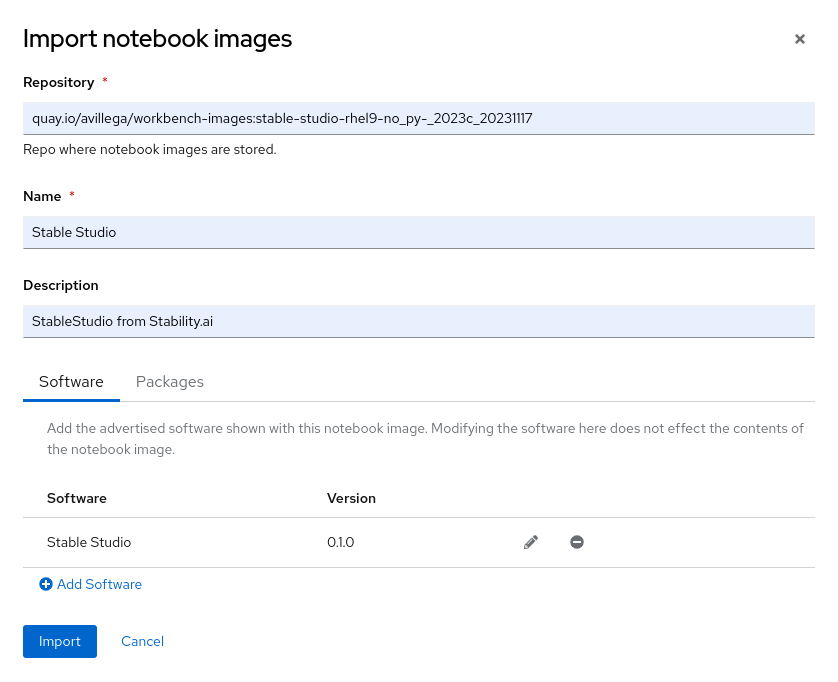

# StableStudio (Stability.ai) for RHODS
This document explains how to build and install StableStudio from Stability.ai
on RHODS

## Requirements:
- Openshift >= v4.13
- RHODS installed


## Deployment Options
Currently, there are two different ways to install StableStudio on RHODS:
  1. External application: Can be accesses from RHODS, but is running de-coupled
     of RHODS, as a separate deployment.
  2. As a Built-in Notebook Image, in the Notebook Servers section.


## Installing as external application
This method is not official or supported, but feel free to use it if it's more
convenient in your case.

The code and manifests are available here on this [GH Repo]( https://github.com/r2dedios/StableStudio/tree/rhods-integration).
Please, follow the next steps:

1. Cloning repo of StableStudio
```sh
# Getting code
git clone https://github.com/r2dedios/StableStudio.git
cd StableStudio
git checkout rhods-integration

# Creating project
export NS="stable-studio"
oc new-project $NS
```

2. Build a container image to be deployed on Openshift. There are two different
   ways to do this. Building it locally or using Openshift internal registry

    1. BuildConfig
    ```sh
    # Build Config for obtain and build the image, and push it into Openshift internal registry
    oc apply -f manifests/openshift/build-config.yaml

    oc start-build stable-studio-image
    # Wait for image building finish
    ```

    2. Local Building
    ```sh
    export IMAGE_ORG="<your-organization>"
    export IMAGE_SERVER="quay.io"
    export IMAGE_TAG="latest"


    podman build -t stable-studio:v0.1.0 -f ./manifests/Containerfile .
    podman tag localhost/stable-studio:v0.1.0 $IMAGE_SERVER/$IMAGE_ORG/stable-studio:latest
    podman push $IMAGE_SERVER/$IMAGE_ORG/stable-studio:latest
    ```

3. Deploy the application
```sh
# Configure container image
vim manifests/openshift/stable-studio.yaml
#  -   21         - image: quay.io/avillega/stable-studio:latest
#  +   21         - image: quay.io/<YOUR_ORGANIZATION>/stable-studio:latest

# Deploys Deployment.apps,Service,Route and SA
oc apply -f manifests/openshift/stable-studio.yaml

# Assign 'anyuid' SCC to StableStudio ServiceAccount to allow running with an specific UID
oc adm policy add-scc-to-user anyuid -z stable-studio
```

4. Once the application is running, create the route to expose the service by HTTPS
```sh
oc apply -f manifests/openshift/rhods-tile.yaml
```

5. Create ConfigMap to enable the App
```sh
oc apply -f - << _EOF_
kind: ConfigMap
apiVersion: v1
metadata:
  name: stable-studio-enable
  namespace: redhat-ods-applications
data:
  validation_result: 'true'
_EOF_
```

6. Get RHODS Route
```sh
oc get routes rhods-dashboard -n redhat-ods-applications -o jsonpath={.spec.host}
```

7. Access to the console, and login.

8. Check StableStudio is ready to be used


9. Click on 'Launch Application' to open a new tab on StableStudio console


## Install as a Builtin Notebook Image
This method will deploy StableStudio as a Notebook image.

1. Cloning repo of workbench-images
```sh
# Getting code
git clone https://github.com/r2dedios/workbench-images.git
cd workbench-images
git checkout stability-studio-bundle
```

2. Build a container image to be deployed as a Notebook Image
```sh
# Set image Name
image_name=stable-studio-rhel9-no_py-_2023c_20231117

# Building image
cd recipes/${image_name}
podman build -t workbench-images:${image_name} .
```

3. Push images
```sh
# Set quay organization
IMAGE_ORG="<YOUR_ORGANIZATION>"

# Check is image is present
podman images --format "{{.Repository}}:{{.Tag}}" | grep $image_name > /dev/null 2>&1

# Push
podman push localhost/workbench-images:$image_name quay.io/${IMAGE_ORG}/workbench-images:$image_name
podman push localhost/workbench-images:$image_name quay.io/${IMAGE_ORG}/workbench-images:${image_name::-8}latest

# Go back to root folder
cd -
```

4. Once the image is pushed, let's go to RHODS console to add the new Notebook image
```sh
oc get routes rhods-dashboard -n redhat-ods-applications -o jsonpath={.spec.host}
```

5. Add Notebook image


6. Create Notebook


7. Start Notebook


8. Notebook Started

