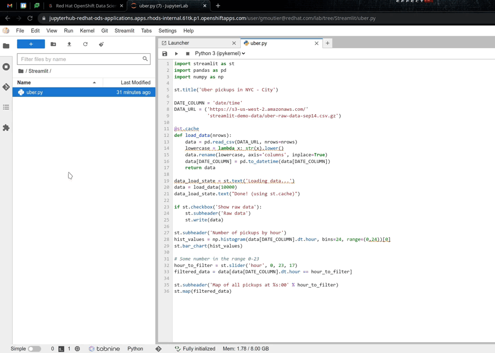

# Streamlit Notebook

Custom notebook based on RHODS standard data science notebook, adding:

* [Streamlit](https://streamlit.io/) ([Github repo](https://github.com/streamlit/streamlit))

Streamlit turns data scripts into shareable web apps in minutes.
All in pure Python. No front‑end experience required.

## Usage

On top of the Streamlit package itself, this image includes jupyter-server-proxy and a custom JupyterLab extension to easily launch your files.

You can either:

* From the main menu bar, click on the Streamlit menu item, then Select file. In the dialog box select the file to launch with Streamlit.
* From the file browser on the left, right-click on the file you want to launch. The Streamlit option in the contextual menu only shows if you selected a Python file.

A new Terminal will open in your JupyterLab, launch Streamlit and give you information on where the app is accessible. And a new tab will open automatically in your browser to display the app!

To shut down the Streamlit app you simply have to close the Terminal window, it will also shut down the associated Kernel.